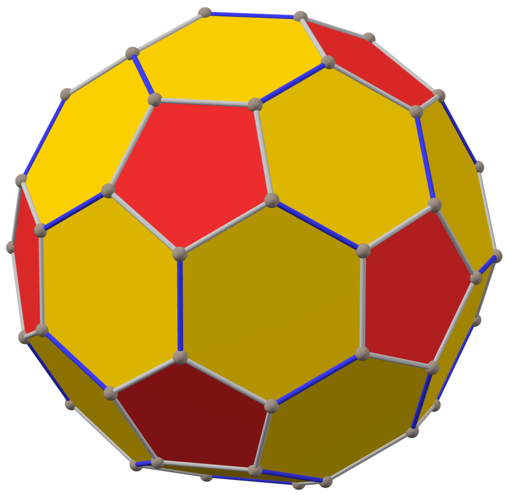
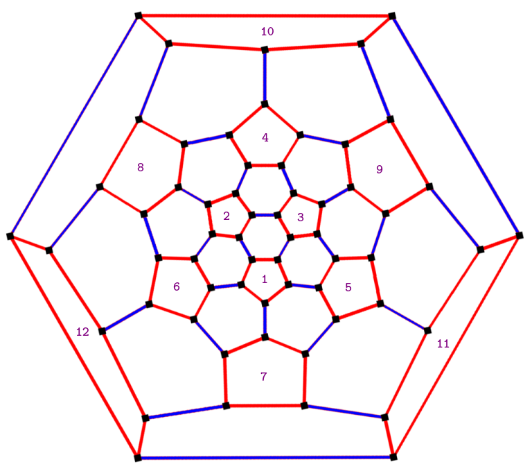

Shopee Planet is a new game in Shopee app. In this game, you are living on a planet which looks like a giant soccer ball. Similar to a soccer ball, there are 12 pentagon faces and 20 hexagon faces which form a "Truncated Icosahedron" as follows:

Figure 1: The giant soccer ball

On each pentagon face, there is a tree. Each tree will produce some Shopee coins after each day. After seven days, if the coins on a face are not collected, the tree on that face will stop producing coins (until the coins are collected). Due to the climate difference between pentagon faces and hexagon faces, trees are only available on pentagon faces.

Let's "flatten" the soccer ball and number the pentagon faces as follows:

Figure 2: The giant soccer ball flattened

There are D days in total. On the first day (day 0), you are standing on the hexagon face surrounded by face 1, 2, and 3 (the center face in Figure 2). Each day, you have to move to an adjacent face (you are not allowed to stay at the current face), collect all the Shopee coins on that face (if available). The number of coins you can collect is determined by this rule:

- If you are standing on a hexagon face, there are no Shopee coins to collect.
- Otherwise, let K be the id of the pentagon face that you are standing on,
    - If this is the first time you visit this face, the number of coins is C[K, 7]
    - Otherwise, let P be the index of the most recent day that you visited this face, let Q be the index of the current day, the number of coins is C[K, min(Q - P, 7)]

C is a 12-by-7 matrix of integers. It is guaranteed that C[K,i] <= C[K,j] for all i < j.
Find the maximum number of Shopee coins that you can collect at the end of day D - 1.

 

**Input**

The first line consists of an integer D, the number of days (1 <= D <= 10^3).
In the next 12 lines, line K (1 <= K <= 12) consists of 7 integers C[K,i] (1 <= i <= 7, 0 <= C[K,i] <= 10^5).
 

**Output**

Output the maximum number of Shopee coins that you can collect.

 

Note

To make sure that you have read the problem statement correctly, here are some facts that you can use to verify your understanding:

- The distance between face 7 and face 10 is 3.
- The distance between face 1 to face 10 is 5.
- There are 12 pentagon faces and 20 hexagon faces.

Sample Input: \
1\
100 200 300 400 500 600 700\
101 201 301 401 501 601 701\
102 202 302 402 502 602 702\
103 203 303 403 503 603 703\
104 204 304 404 504 604 704\
105 205 305 405 505 605 705\
106 206 306 406 506 606 706\
107 207 307 407 507 607 707\
108 208 308 408 508 608 708\
109 209 309 409 509 609 709\
110 210 310 410 510 610 710\
111 211 311 411 511 611 711

Sample Output:\
702

**Explanation** \
On day 0, move to face 3, collect 702 Shopee coins.

Time Limit:	10.0 sec(s) for each input file.
Memory Limit:	256 MB
Source Limit:	1024 KB